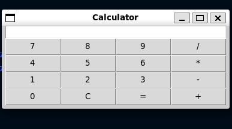

# Calculator App

A basic calculator application built using Python and the Tkinter library.

## Description

This calculator app provides a simple user interface for performing basic arithmetic operations such as addition,
subtraction, multiplication, and division. The application is built using Tkinter, the standard GUI toolkit for Python.

## Features

- User-friendly interface with buttons for digits, operators, clear, and equals.
- Supports addition, subtraction, multiplication, and division.
- Real-time display of input and calculated results.

## Requirements

- Python 3.x
- Tkinter library (usually included with Python)

## How to Run

1. Clone the repository:

    ```bash
    git clone https://github.com/briankimurgor/calculator-app.git
    ```

2. Navigate to the project directory:

    ```bash
    cd calculator-app
    ```

3. Run the calculator app:

    ```bash
    python3 calc.py
    ```

4. The calculator app window should appear, allowing you to perform calculations.
5. 

## How to Test

To run the unit tests for the calculator app:

1. Navigate to the project directory:

    ```bash
    cd calculator-app
    ```

2. Run the tests:

    ```bash
    python -m unittest tests.test_calc
    ```

3. The test results will be displayed, indicating whether the application functions as expected.

## Contributing

Feel free to contribute to this project by opening issues or submitting pull requests. Your feedback and improvements are highly appreciated.

## License

This calculator app is open-source and distributed under the [MIT License](LICENSE). You are free to use, modify, and distribute the code
 as per the terms of the license.
